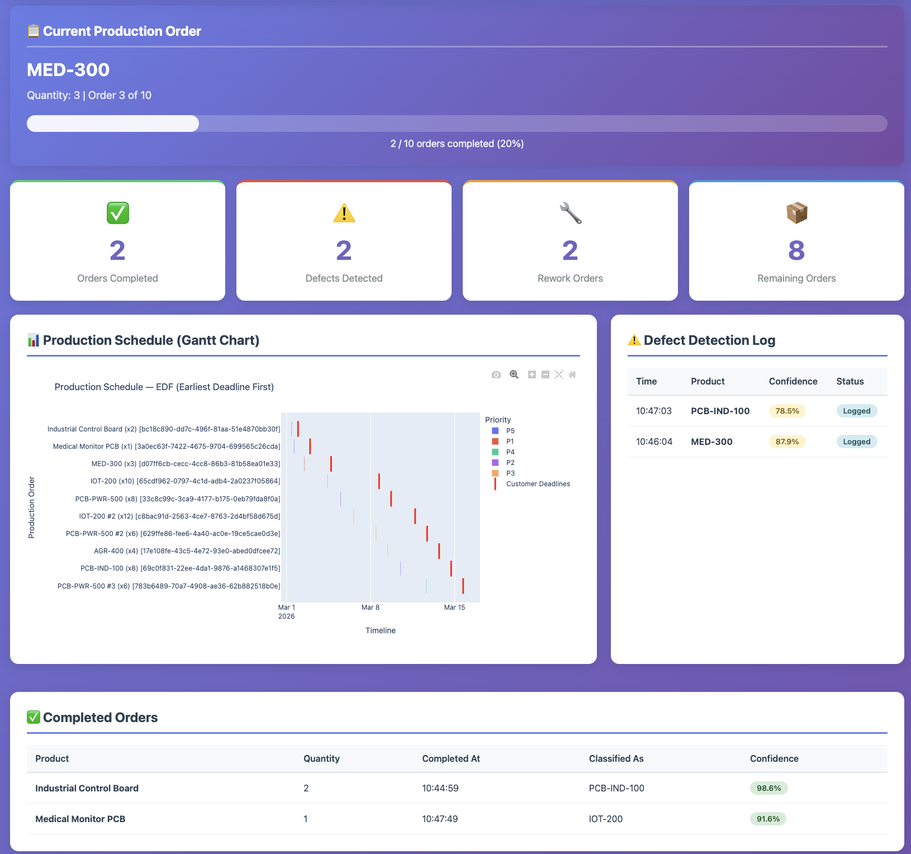
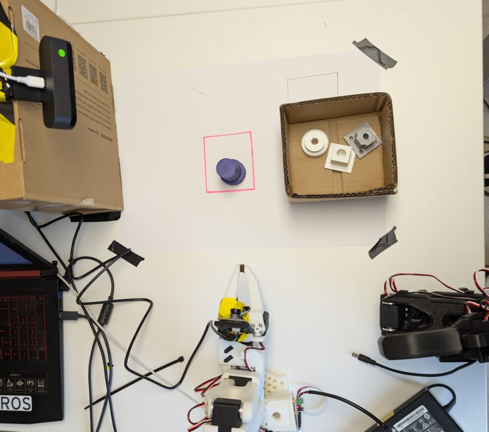

# NovaBoard Electronics — Team ILS

> **Physical AI Hacks** by [Forgis](https://forgis.ai) | Partner challenge by [Arke](https://www.arke.so/)

**AI Production Scheduling Agent for PCB Manufacturing**

An end-to-end intelligent production scheduling system that reads sales orders from [Arke](https://www.arke.so/), resolves scheduling conflicts using EDF, gets human approval via Telegram, monitors the production line with live cameras, classifies products with an EfficientNet CNN, and drives robotic pick-and-place using the **ACT (Action Chunking with Transformers) policy** via LeRobot — all from a single `python main.py` command.

---

## Overview

This project was built during the **Physical AI Hacks** hackathon organized by [Forgis](https://forgis.ai). The **NovaBoard Electronics** challenge was provided by [Arke](https://www.arke.so/), a production management platform.

We implement a full-stack AI production scheduling agent for NovaBoard Electronics, a contract PCB manufacturer. The system:

1. **Reads** 12 open sales orders from the Arke ERP API
2. **Detects** scheduling conflicts (priority vs. deadline mismatches)
3. **Plans** production using configurable policies (EDF, group-by-product, batch-split)
4. **Creates & schedules** production orders in Arke with workday-aware timing
5. **Gets human approval** via Telegram (with Gantt chart) or terminal
6. **Monitors** the production line using live multi-camera feeds
7. **Classifies** products in real time with an EfficientNet-B0 model (7 classes including defect variants)
8. **Executes** robotic pick-and-place via LeRobot SO101 using the **ACT policy**
9. **Manages** order lifecycle: completion, defect handling, and rework order creation
10. **Serves** a live web dashboard for tracking production status

---

## Core Challenge

**The Scheduling Conflict:**
SmartHome IoT has escalated order SO-005 from P3 to P1 priority. However, SO-003 (AgriBot) has a deadline of March 4, which is tighter than SO-005's deadline of March 8. The agent must recognize this and schedule by deadline (EDF) rather than blind priority.

## Factory Constraints

| Constraint | Value |
|---|---|
| Production lines | 1 (sequential batch processing) |
| Daily capacity | 480 minutes (8 hours: 9 AM – 5 PM) |
| Operating days | 7 days per week |
| Production phases | SMT → Reflow → THT → AOI → Test → Coating → Pack |
| Parallelization | None — all units complete each phase before moving on |

---

## Architecture

```
┌──────────────┐     ┌──────────────┐     ┌──────────────────┐
│  Arke ERP    │◄───►│  API Client   │◄───►│  Production      │
│  (REST API)  │     │  (client.py)  │     │  Planner         │
└──────────────┘     └──────────────┘     │  (planner.py)    │
                                           └────────┬─────────┘
                                                    │
                     ┌──────────────────────────────┼──────────────────────┐
                     │                              │                      │
              ┌──────▼──────┐            ┌──────────▼─────────┐   ┌───────▼────────┐
              │  Telegram    │            │  Camera Monitor     │   │  Web Dashboard  │
              │  Notifier    │            │  (camera.py)        │   │  (Flask :8080)  │
              │  + Gemini AI │            │  Multi-cam + OpenCV │   │  REST + Plotly  │
              └──────┬───────┘           └──────────┬──────────┘  └────────────────┘
                     │                              │
              ┌──────▼──────┐            ┌──────────▼──────────┐
              │  Command     │            │  EfficientNet-B0    │
              │  Mapper      │            │  Classifier         │
              │  (Gemini 2.5 │            │  (7 classes)        │
              │   Flash NLP) │            └──────────┬──────────┘
              └──────────────┘                       │
                                           ┌─────────▼──────────┐
                                           │  Robot Executor     │
                                           │  (LeRobot SO101     │
                                           │   ACT policy)       │
                                           └─────────┬──────────┘
                                                     │
                                           ┌─────────▼──────────┐
                                           │  Production         │
                                           │  Controller          │
                                           │  (order lifecycle,  │
                                           │   defect → rework)  │
                                           └─────────────────────┘
```

---

## Implementation Steps

### Step 1 — Read Sales Orders
Fetch all accepted sales orders from the Arke API, including product details, quantities, deadlines, and priority levels. Orders are sorted by deadline (EDF) and analyzed for priority-vs-deadline conflicts.

### Step 2 — Choose Planning Policy
Select a batching strategy interactively (via Telegram or terminal):

| Policy | Description |
|---|---|
| **Level 1: EDF** (required) | One production order per sales order line, sorted by earliest deadline |
| **Level 2: Group by Product** | Merge orders for the same product to reduce machine changeovers |
| **Level 2: Split in Batches** | Cap batch size (e.g., 10 units) the reduce WIP and improve flow |

### Step 3 — Create Production Orders
Generate production orders in Arke with sequential start/end times, mapping product names to catalog UUIDs. Each order's duration is estimated and scheduled to start when the previous finishes.

### Step 4 — Schedule Phases
- Call `_schedule` endpoint to generate the 7-phase sequence per order
- Apply **workday constraints** (9 AM – 5 PM, 480 min/day) with automatic carry-over to the next day
- Validate all deadlines and report any late orders with delay duration

### Step 5 — Human in the Loop
- Present the full schedule with a **Plotly Gantt chart** (sent as PNG to Telegram)
- Planner can **APPROVE** or **REJECT** with a reason
- On rejection, the planner can adjust the schedule with natural language commands:
  - `SWAP 1 3` — swap order positions
  - `MOVE 5 TO 2` — reorder
  - `DATES 3 +2` — delay an order by N days
- Schedule is re-presented until approved

### Step 6 — Physical Integration
After approval, the system activates:

- **Multi-camera monitoring** — live OpenCV feed with overlay (phase, status, timestamp), auto-saves frames every N seconds to `monitoring_frames/`
- **EfficientNet classifier** — classifies camera frames into 7 product/defect classes in real time
- **Robot executor** — triggers LeRobot SO101 ACT policy to perform pick-and-place based on classification results
- **Production controller** — completes orders on correct classification, creates rework orders on defect detection
- **Web dashboard** — Flask server on port 8080 with live status, Gantt chart, defect log, and completed order list

### Step 7 — Confirm & Execute
- Orders are moved to `in_progress` status
- Phase lifecycle is driven through completion
- Progress is tracked and exceptions are handled

---

## Telegram Bot Integration

The entire workflow is controllable via Telegram with **natural language** powered by Gemini 2.5 Flash:

| Command Type | Examples |
|---|---|
| Policy selection | `1`, `EDF`, `"earliest deadline first"`, `"split batches"`, `"3:15"` (policy 3, batch size 15) |
| Confirmations | `"yes"`, `"sure"`, `"go ahead"`, `"no"`, `"cancel"` |
| Camera capture | `"CAPTURE"`, `"take a photo"`, `"snap picture"` |
| Gantt chart | `"GANTT"`, `"show schedule"`, `"production plan"` |
| Classification | `"CLASSIFY"`, `"what is this"`, `"verify product"` |
| Camera selection | `"0,1"`, `"camera 0 and 1"`, `"all cameras"` |
| Save interval | `"5"`, `"every 10 seconds"`, `"half a minute"` |
| Schedule adjustments | `"swap orders 1 and 3"`, `"move order 5 to position 2"`, `"delay order 3 by 2 days"` |

---

## Product Classification (CNN)

An **EfficientNet-B0** model trained on production line images for real-time product verification:

| Class | Type |
|---|---|
| AGR-400 | Product |
| IOT-200 | Product |
| MED-300 | Product |
| PCB-IND-100 | Product |
| PCB-PWR-500 | Product |
| PCB\_IND\_100\_defect | Defect variant |
| MED\_300\_defect | Defect variant |

**Training:** `python src/physical/classifier.py` — trains for 8 epochs with augmentation, saves best checkpoint to `efficient-net.pth`.

**Inference:** The `ProductClassifier` class loads the checkpoint and classifies live camera frames, feeding results into the production controller and robot executor.

---

## Robot Integration (LeRobot + ACT Policy)

We use the **ACT (Action Chunking with Transformers) policy** via LeRobot on an **SO101 follower arm** to execute pick-and-place actions for each classified product. Teleoperated episodes were recorded per product variant and the trained policy physically sorts correct and defective parts.

- 5 product datasets + 2 defect datasets stored in `src/physical/data/`
- Automatic product-to-dataset mapping (e.g., `PCB-IND-100` → `pick_PCB_IND_100`)
- Confidence threshold gating — robot only executes when classification confidence ≥ 70%
- Defective parts trigger a separate pick-and-place action (different trajectory)
- Dry-run mode available for testing without hardware

---

## Web Dashboard

A Flask-based dashboard served on `http://localhost:8080` provides:

| Endpoint | Description |
|---|---|
| `/` | Live HTML dashboard |
| `/api/status` | Production statistics |
| `/api/current-order` | Current order being produced |
| `/api/completed-orders` | List of completed orders |
| `/api/defects` | Defects detected |
| `/api/rework-orders` | Rework orders created |
| `/api/gantt` | Plotly Gantt chart data (JSON) |
| `/api/schedule` | Full production schedule |

---

## API Endpoints (Arke ERP)

| Method | Endpoint | Description |
|---|---|---|
| `POST` | `/login` | Authenticate and obtain access token |
| `GET` | `/sales/order?status=accepted` | List accepted sales orders |
| `GET` | `/sales/order/{id}` | Sales order details (products, quantities) |
| `GET` | `/product/product` | Product catalog |
| `PUT` | `/product/production` | Create a production order |
| `POST` | `/product/production/{id}/_schedule` | Generate phase sequence |
| `GET` | `/product/production/{id}` | Get production order with phases |
| `POST` | `/product/production/{id}/_update_starting_date` | Update start date |
| `POST` | `/product/production/{id}/_update_ending_date` | Update end date |
| `POST` | `/product/production/{id}/_confirm` | Confirm → in\_progress |
| `POST` | `/product/production-order-phase/{id}/_start` | Start a phase |
| `POST` | `/product/production-order-phase/{id}/_complete` | Complete a phase |
| `POST` | `/product/production-order-phase/{id}/_update_starting_date` | Update phase start |
| `POST` | `/product/production-order-phase/{id}/_update_ending_date` | Update phase end |

---

## Quick Start

### 1. Create Conda Environment

```bash
conda env create -f environment.yml
conda activate novaboard-scheduling
```

Or with pip:

```bash
conda create -n novaboard-scheduling python=3.10
conda activate novaboard-scheduling
pip install -r requirements.txt
```

### 2. Configure Environment Variables

```bash
cp .env.example .env
```

Edit `.env` and fill in your credentials:

| Variable | Description | Required |
|---|---|---|
| `ARKE_API_BASE_URL` | Arke API endpoint (e.g., `https://hackathon17.arke.so/api`) | Yes |
| `ARKE_USERNAME` | API username | Yes |
| `ARKE_PASSWORD` | API password | Yes |
| `TELEGRAM_BOT_TOKEN` | Telegram bot token from @BotFather | Optional |
| `TELEGRAM_CHAT_ID` | Your Telegram chat ID | Optional |
| `GEMINI_API_KEY` | Google Gemini API key for NLP command interpretation | Optional |
| `ROBOT_PORT` | Serial port for SO101 arm (e.g., `/dev/ttyACM1`) | Optional |
| `ROBOT_CALIBRATION_DIR` | Path to robot calibration files | Optional |

### 3. Run the Agent

```bash
python main.py
```

The interactive workflow will guide you through all 7 steps. If Telegram is configured, all prompts are sent there with natural language support; otherwise, the terminal is used as fallback.

### 4. Train the Classifier (optional)

```bash
python src/physical/classifier.py
```

Requires training images in `data/` organized by class folder.

For detailed setup instructions, see [SETUP.md](SETUP.md).

---

## Project Structure

```
ILS_hackathon/
├── README.md                        # This file
├── SETUP.md                         # Detailed setup guide
├── .env.example                     # Environment variable template
├── .gitignore                       # Git ignore rules
├── environment.yml                  # Conda environment definition
├── requirements.txt                 # pip dependencies
├── calibration_notes.txt            # Robot calibration notes
├── main.py                          # Main entry point (all 7 steps)
│
├── src/
│   ├── api/
│   │   └── client.py               # Arke REST API client (auth, CRUD, scheduling)
│   │
│   ├── models/
│   │   └── order.py                # SalesOrderLine & ProductionOrder dataclasses
│   │
│   ├── scheduler/
│   │   └── planner.py              # Planning policies (EDF, group-by-product, batch-split)
│   │
│   ├── messaging/
│   │   ├── notifier.py             # Telegram notifications, Gantt chart (Plotly), approval flow
│   │   └── command_mapper.py       # Gemini 2.5 Flash NLP command interpreter
│   │
│   ├── monitoring/
│   │   └── camera.py               # Multi-camera OpenCV monitor with Telegram listener
│   │
│   ├── physical/
│   │   ├── classifier.py           # EfficientNet-B0 training script (7-class)
│   │   ├── inference.py            # ProductClassifier — real-time frame classification
│   │   ├── robot_executor.py       # LeRobot SO101 ACT policy executor
│   │   ├── production_controller.py # Order lifecycle, defect → rework flow
│   │   ├── calibration/            # Robot calibration files
│   │   │   ├── robots/             # SO101 follower calibration
│   │   │   └── teleoperators/      # Teleoperator calibration
│   │   └── data/                   # Episode datasets (pick_PCB_IND_100, etc.)
│   │
│   └── ui/
│       ├── dashboard_server.py     # Flask REST API + web dashboard server
│       └── static/                 # HTML, CSS, JS frontend assets
│           ├── dashboard.html
│           ├── style.css
│           └── dashboard.js
│
├── future_integrations/
│   ├── README.md                   # Integration roadmap (CNN triggers, IoT, PLC)
│   ├── CAMERA_TRIGGERS.md          # Camera trigger API documentation
│   └── trigger_api_example.py      # Example: Flask endpoint for external capture triggers
│
├── data/                            # Training image datasets (per product class)
│   ├── pick_AGR_400/
│   ├── pick_IOT_200/
│   ├── pick_MED_300/
│   ├── pick_MED_300_defect/
│   ├── pick_PCB_IND_100/
│   ├── pick_PCB_IND_100_defect/
│   └── pick_PCB_PWR_500/
│
└── tests/                           # Test suite (pytest)
```

---

## Technology Stack

| Category | Technology | Purpose |
|---|---|---|
| Language | Python 3.10 | Core language |
| Environment | Conda | Dependency & environment management |
| HTTP | requests, httpx | Arke API communication |
| Data Models | pydantic, dataclasses | Order & production data validation |
| Config | python-dotenv | `.env` file loading |
| Messaging | Telegram Bot API | Human-in-the-loop notifications & approval |
| NLP | Google Gemini 2.5 Flash | Natural language command interpretation |
| Visualization | Plotly, Pandas, Kaleido | Gantt charts (interactive + PNG export) |
| Computer Vision | OpenCV (cv2) | Live camera feed, frame capture, overlay |
| Deep Learning | PyTorch, Torchvision, timm | EfficientNet-B0 product classifier |
| Robotics | LeRobot (feetech) | SO101 arm — ACT policy for pick-and-place |
| Web Dashboard | Flask | REST API + production status UI |
| Testing | pytest, pytest-cov | Unit & integration testing |
| Code Quality | black, flake8 | Formatting & linting |

---

## Demo

### Live Web Dashboard


### Virtual Factory Floor Setup
Simulated production line used for testing and development.



### Robot Pick-and-Place — Correct Part
The SO101 arm executes the ACT policy trajectory for a correctly classified product.

https://github.com/user-attachments/assets/10a77e47-aa3b-4471-b387-1e65c3eb7dfb

### Robot Pick-and-Place — Defective Part
When the classifier detects a defect, a separate pick-and-place trajectory moves the part to the reject bin.

https://github.com/user-attachments/assets/fc2729ab-5423-498b-b8f6-cb7584a3f96f

---

## Team

**Team ILS** — [Physical AI Hacks](https://forgis.ai) by Forgis | [Arke](https://www.arke.so/) Challenge

---

## Acknowledgements

- **[Forgis](https://forgis.ai)** — Hackathon organizer (Physical AI Hacks)
- **[Arke](https://www.arke.so/)** — Partner providing the NovaBoard Electronics challenge and production management API
- **[LeRobot (Hugging Face)](https://github.com/huggingface/lerobot)** — Robotics framework for teleoperation and ACT policy training

---

## License

(To be determined)
